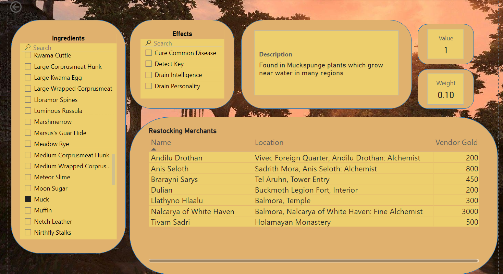

For those who arent familiar, The Elder Scrolls III: Morrowind is a 2002 action role-playing game developed by Bethesda Game Studios and published by Bethesda Softworks. Even though this game is over two decades olds at this point, it is still celebrated as one of the greatest open world RPG's ever created. Though it was groundbreaking at the time, it does suffer from some antiquated game mechanics and is missing many quality of life features that we take for granted in modern games.

Morrowind has a very robust alchemy system. Throughout the game are numerous differnt ingredients which each have up to four unique effects. Mixing ingredients with like effects can create potions with that effect. The problem is that there is no in game guide telling you which ingredients contain which effects, the only way to know is to actually get you hands on the ingredient itself. To make things even more vague, if your characters alchemy skill isnt high enough, you may not even be able to see all four effects of an ingredient even if you encounter it.

That is where the Morrowind Alchemy Project comes in! Using a SQLite database i have stored all of the relevant data needed for searching ingredients, their effects, weights, values, and the vendors that sell unlimited supplies of that ingredient. Using primary and foreign keys I have created relationships to all necessary data to make querying simple. A copy of the database ERD diagram is included in this repo.

Using PowerBI I have created a dashboard allowing you to search for any ingredient in the game using the search bar/slicer located at the left of the screen. The other visuals will then be populated with all relevant data for that ingredient which includes the effects that ingredient contains, its description, a list of vendors that seel that ingredient and their location, along with the ingredients weight and value.

Note that in order to get SQLite databases to work with PowerBI you must install the SQLite ODBC driver and configure the database as an ODBC data source. The steps for that are as follows:

Step 1: Install SQLite ODBC Driver
Download the SQLite ODBC Driver by going to the SQLite ODBC Driver website.
Download the appropriate version (32-bit or 64-bit) based on your Power BI version.
Install the Driver

Step 2: Set Up an ODBC Data Source
Open ODBC Data Source Administrator by pressing Win + R and type 'odbcad32' and press enter
If you're using 64-bit Power BI, use the 64-bit ODBC Data Source Administrator (odbcad32.exe in C:\Windows\System32).
For 32-bit Power BI, use the 32-bit version (odbcad32.exe in C:\Windows\SysWOW64).
Click Add under the User DSN or System DSN tab (System DSN is available to all users).
Select SQLite3 ODBC Driver and click Finish.
Configure the SQLite ODBC Driver:
Provide a Data Source Name (DSN) 
Browse to select the Morrowind_Alchemy database file
Click OK to save the data source.

Step 3: Connect Power BI to SQLite
Open the PowerBI file
Go to Home > Get Data > ODBC.
In the ODBC dialog, select DSN.
Choose the data source you created earlier
Click OK
Power BI will display the tables in your SQLite database.
Select the tables or views you want to import.
Click Load to bring the data into Power BI.

